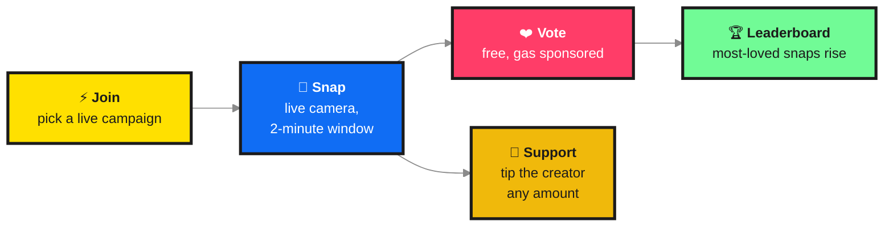
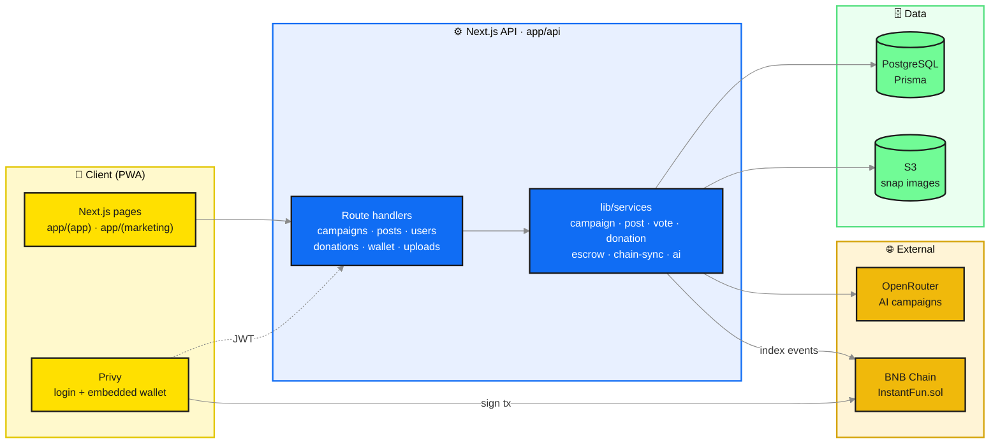
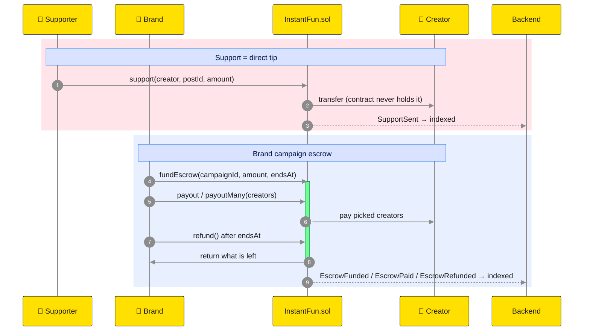
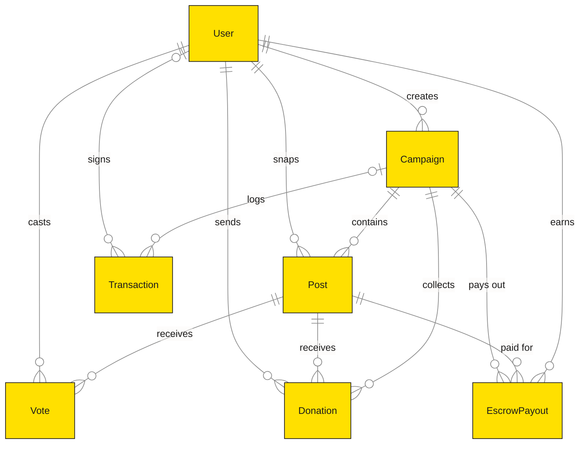

# instant.fun

**Snap. Join. Get Voted.** Post instantly, get discovered, support creators.

instant.fun is a mobile-first Web3 social app. Users join trending photo campaigns, shoot a live snap,
vote for their favorites for free, and tip creators directly on **BNB Chain**.

| | |
|---|---|
| **Frontend** | Next.js 16 (App Router) · React 19 · Tailwind CSS 4 · Motion |
| **Auth & wallet** | Privy (embedded wallets) |
| **Database** | PostgreSQL · Prisma 7 |
| **Storage** | S3 (snap uploads, served through `/api/media`) |
| **AI** | OpenRouter (campaign generation from trends) |
| **Chain** | BNB Chain · `InstantFun.sol` (Foundry), via ethers v6 |
| **Demo video** | Remotion ([`video/`](video)) |

---

## How it works



Support is a **direct tip**: money goes from the supporter to the creator. It is not a bet, an
investment, or an entry fee. See [`PRD.md`](PRD.md) for the full product spec.

---

## Architecture



The backend never trusts amounts sent by the client: it reads them from on-chain events
(`lib/services/chain-sync.service.ts`).

---

## Money flow on-chain

`contracts/src/InstantFun.sol` handles all money. Details are in [`contracts/README.md`](contracts/README.md).



---

## Data model



Full schema: [`prisma/schema.prisma`](prisma/schema.prisma).

---

## Getting started

**1. Install dependencies** (also runs `prisma generate`)

```bash
npm install
```

**2. Configure `.env`** with the variables below.

| Variable | Purpose |
|---|---|
| `DATABASE_URL`, `DATABASE_URL_POOLED` | PostgreSQL connection |
| `NEXT_PUBLIC_PRIVY_APP_ID`, `PRIVY_APP_SECRET` | Privy auth |
| `OPENROUTER_API_KEY`, `OPENROUTER_MODEL` | AI campaign generation |
| `AWS_ACCESS_KEY_ID`, `AWS_SECRET_ACCESS_KEY`, `AWS_REGION` | S3 uploads |
| `BLOCKCHAIN_RPC_URL`, `CHAIN_ID` | Server-side chain access |
| `NEXT_PUBLIC_CHAIN_ID`, `NEXT_PUBLIC_INSTANT_FUN_ADDRESS` | Deployed `InstantFun` contract |
| `NEXT_PUBLIC_USDC_ADDRESS`, `NEXT_PUBLIC_USDC_DECIMALS` | Support token |

Testnet contract addresses are listed in [`contracts/README.md`](contracts/README.md#deployments).

**3. Set up the database**

```bash
npm run db:migrate
```

```bash
npm run db:seed
```

**4. Run the dev server** and open [http://localhost:3000](http://localhost:3000)

```bash
npm run dev
```

### Scripts

| Script | What it does |
|---|---|
| `npm run dev` | Start the dev server |
| `npm run build` | `prisma generate` + production build |
| `npm run start` | Serve the production build |
| `npm run lint` | ESLint |
| `npm run db:migrate` | Apply Prisma migrations |
| `npm run db:seed` | Seed mock data |
| `npm run db:studio` | Open Prisma Studio |
| `npm run db:reset` | Reset the database and re-seed |

---

## Project structure

```text
instant-fe/
├── app/
│   ├── (marketing)/   # landing page
│   ├── (app)/         # the mobile app: (tabs) home, campaigns, snap, wallet… · (focus) create, onboarding
│   ├── api/           # route handlers
│   └── docs/          # API docs
├── components/        # UI by feature (campaign, snap, leaderboard, landing, ui…)
├── lib/
│   ├── services/      # business logic
│   ├── contracts/     # contract ABI + helpers
│   └── …              # auth, api client, formatting
├── prisma/            # schema, migrations, seed
├── contracts/         # Foundry project: InstantFun.sol
├── public/            # brand, marketing and mock images
└── video/             # Remotion demo video
```
