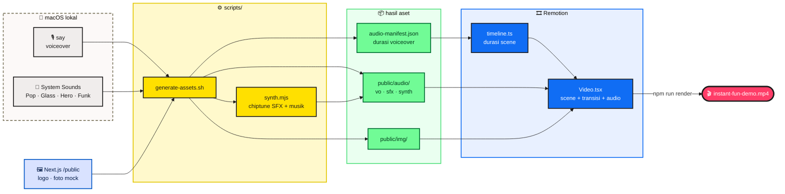
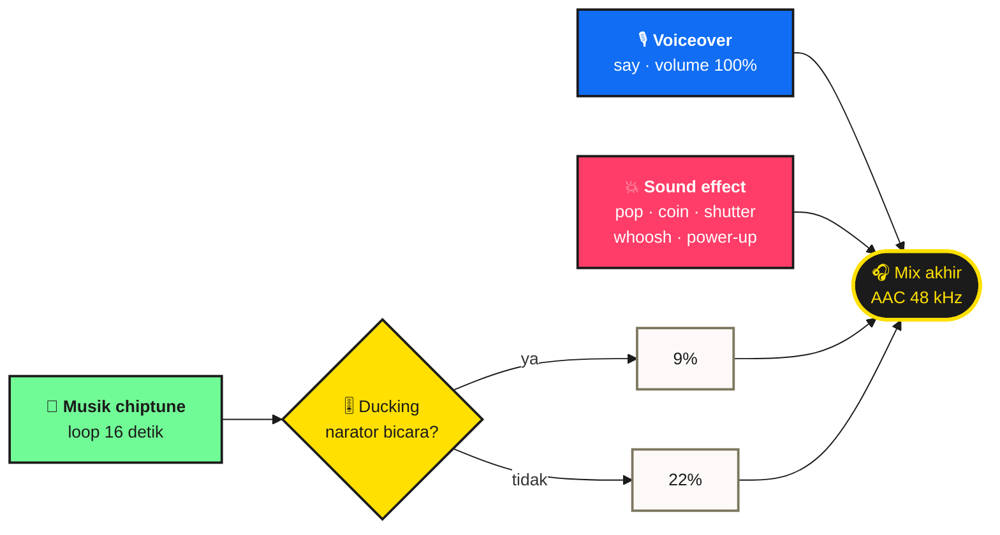

# 🎬 instant.fun — Demo Video

Video demo produk berdurasi **±40 detik** yang dibuat dengan [Remotion](https://www.remotion.dev).
Gayanya mengikuti landing page: kuning & biru brand, font **Plus Jakarta Sans** + **Press Start 2P**,
doodle pixel-art, dan teks yang "pop" kata per kata.

| | |
|---|---|
| **Resolusi** | 1920 × 1080 · 30 fps |
| **Durasi** | ±40 detik (7 scene, mengikuti panjang voiceover) |
| **Voiceover** | macOS `say` — default suara *Samantha* |
| **Sound effect** | Suara sistem macOS + efek chiptune hasil sintesis |
| **Musik** | Loop chiptune 120 BPM, otomatis mengecil saat narator bicara |
| **Output** | `out/instant-fun-demo.mp4` |

> [!NOTE]
> Pembuatan aset membutuhkan **macOS** (untuk `say` dan `/System/Library/Sounds`) serta **ffmpeg**
> (`brew install ffmpeg`). Setelah aset dibuat, render bisa dijalankan di mana saja.

---

## 🚀 Cara Pakai

```bash
npm install
```

```bash
npm run assets
```

```bash
npm run dev
```

```bash
npm run render
```

| Perintah | Fungsi |
|---|---|
| `npm run assets` | Membuat voiceover, SFX, musik, menyalin gambar ke `public/`, dan menulis durasi ke `src/audio-manifest.json` |
| `npm run dev` | Membuka Remotion Studio untuk preview & edit |
| `npm run render` | Render video final ke `out/instant-fun-demo.mp4` |

---

## 🔧 Alur Pembuatan



Durasi setiap scene **dihitung otomatis** dari panjang voiceover di `audio-manifest.json`.
Jadi kalau narasi atau suara diganti, cukup jalankan ulang `npm run assets`; timing video akan menyesuaikan.

---

## 🎞️ Alur Scene

```mermaid
%%{init: {'theme':'base', 'themeVariables': {'fontFamily':'Plus Jakarta Sans, sans-serif', 'fontSize':'14px', 'lineColor':'#1c1b1b', 'edgeLabelBackground':'#ffffff'}}}%%
flowchart LR
    S1["<b>1 · Intro</b><br/>logo bounce<br/>+ mahkota"]
    S2["<b>2 · Hook</b><br/>Snap now.<br/>Win the moment."]
    S3["<b>3 · Join</b><br/>kartu campaign<br/>Free to enter!"]
    S4["<b>4 · Snap</b><br/>kamera live<br/>timer 2:00"]
    S5["<b>5 · Vote</b><br/>tap ❤️<br/>$0 gas"]
    S6["<b>6 · Win</b><br/>podium<br/>hujan koin BNB"]
    S7["<b>7 · Outro</b><br/>Snap. Join.<br/>Get Voted."]

    S1 -- slide --> S2 -- iris --> S3 -- wipe --> S4
    S4 -- slide --> S5 -- "clock wipe" --> S6 -- iris --> S7

    classDef yellow fill:#ffe000,stroke:#1c1b1b,stroke-width:3px,color:#1c1b1b
    classDef blue fill:#106df4,stroke:#1c1b1b,stroke-width:3px,color:#ffffff
    classDef cream fill:#fcf9f8,stroke:#1c1b1b,stroke-width:3px,color:#1c1b1b
    classDef dark fill:#1c1b1b,stroke:#ffe000,stroke-width:3px,color:#ffffff
    classDef pink fill:#ff3d68,stroke:#1c1b1b,stroke-width:3px,color:#ffffff
    classDef green fill:#71fb96,stroke:#1c1b1b,stroke-width:3px,color:#1c1b1b

    class S1,S7 yellow
    class S2 blue
    class S3 cream
    class S4 dark
    class S5 pink
    class S6 green
```



| # | Scene | Latar | Narasi | Waktu |
|---|---|---|---|---|
| 1 | Intro | 🟨 Kuning | *"Hey! Welcome to instant dot fun!"* | 0:00 – 0:04 |
| 2 | Hook | 🟦 Biru | *"Snap now. Win the moment."* | 0:03 – 0:07 |
| 3 | Join | ⬜ Krem | *"Step one. Join a live campaign…"* | 0:06 – 0:14 |
| 4 | Snap | ⬛ Gelap | *"Step two. Snap a real moment…"* | 0:13 – 0:21 |
| 5 | Vote | 🟥 Pink | *"Step three. The community votes…"* | 0:21 – 0:28 |
| 6 | Win | 🟩 Hijau | *"Step four. Winners take the prize pool…"* | 0:27 – 0:34 |
| 7 | Outro | 🟨 Kuning | *"Instant dot fun. Snap. Join. Get voted!"* | 0:34 – 0:40 |

Waktu di atas berlaku untuk suara *Samantha* dengan kecepatan 185 wpm. Scene saling tumpang tindih ±0,5 detik selama transisi.

---

## 🔊 Lapisan Audio



| Sumber | File | Dipakai untuk |
|---|---|---|
| macOS `say` | `public/audio/vo/*.wav` | Narasi tiap scene |
| `/System/Library/Sounds` | `public/audio/sfx/*.wav` | Pop teks, glass, hero, funk, bottle |
| `scripts/synth.mjs` | `public/audio/synth/*.wav` | Koin, shutter kamera, whoosh, blip, tick timer, power-up, musik loop |

---

## ✨ Animasi Teks

| Komponen | Efek |
|---|---|
| `PopText` | Kata muncul satu per satu dengan spring *overshoot* + kemiringan acak, lalu bergoyang pelan. Kata tertentu bisa diberi latar stiker berwarna. Tiap kata memutar suara *pop* dengan nada yang naik. |
| `BounceLetters` | Huruf jatuh dan memantul satu per satu (dipakai untuk logo). |
| `StepBadge` | Label "STEP n" berfont pixel yang muncul seperti dicap. |
| `Chip` | Label pil bergaya "toy block" dengan bayangan tebal. |

---

## 🎨 Kustomisasi

**Ganti suara narator atau kecepatannya**

```bash
VOICE="Flo (English (US))" RATE=175 npm run assets
```

**Lihat daftar suara yang tersedia**

```bash
say -v '?'
```

| Mau mengubah… | Edit file |
|---|---|
| Teks narasi | [`scripts/generate-assets.sh`](scripts/generate-assets.sh) (array `LINES`) |
| Jeda sebelum/sesudah narasi | [`src/timeline.ts`](src/timeline.ts) (`voDelay`, `tail`) |
| Warna & font | [`src/theme.ts`](src/theme.ts) |
| Jenis transisi | [`src/Video.tsx`](src/Video.tsx) (`TRANSITIONS`) |
| Volume musik / ducking | [`src/Video.tsx`](src/Video.tsx) (`musicVolume`) |
| Melodi & efek chiptune | [`scripts/synth.mjs`](scripts/synth.mjs) |
| Isi scene | [`src/scenes/`](src/scenes) |

> [!TIP]
> Untuk narasi bahasa Indonesia, pakai `VOICE="Damayanti"` dan terjemahkan juga teks di array `LINES`.

---

## 📁 Struktur Folder

```text
video/
├── scripts/
│   ├── generate-assets.sh   # voiceover, SFX, musik, gambar, manifest
│   └── synth.mjs            # synth chiptune tanpa dependensi
├── src/
│   ├── index.ts             # entry Remotion
│   ├── Root.tsx             # komposisi InstantFunDemo
│   ├── Video.tsx            # urutan scene, transisi, musik + ducking
│   ├── timeline.ts          # durasi scene dari audio-manifest.json
│   ├── theme.ts             # warna & font brand
│   ├── components/          # PopText, Doodles, Brand, Stage, Sfx
│   └── scenes/              # Intro, Hook, Join, Snap, Vote, Win, Outro
├── public/                  # dibuat oleh `npm run assets` (tidak di-commit)
└── out/                     # hasil render (tidak di-commit)
```
